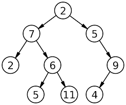

The plan
========

The plan for becoming a freelancer.

The problem
***********

I am not good or I dont like to spend much time reading job offers, I want a
system that can automate the searchs.

Being a freelancer consists for many skills

* Technical Skills

* Soft Skills

* Management Skills

* Selling Skills

* Searching for jobs Skills (Thing that I don't like)

Project purpose
***************

This project aims at facilitating the search of jobs by automating the search.

A freelancer can spend hours searching for a job in sites like freelancer and
upwork and others.

The trick is being specific and choosing a niche, the more specific the search
the less jobs offers one will read.

The less jobs offers one reads the less time one dedicates to reading, this
projects aims at minimazing the time spent in reading job offers in popular
sites like upwork and freelancer and maximizing the hours changed vs time
searching ratio.

In other words, if I expend 30 hours a month searching for a job just to get
10 hours of work charged I have 10/30 = 0.33 ratio of working/searching
but if I spend only 5 hours a month searching for a job and I charge 10 hours
that month that means that the ratio is 10/5 = 2 and I am more productive
because I am expending less time searching for jobs vs charging for my time,
This project aims at maximazing that ratio, by automating searching for jobs.

Solution
********

Choose a searching criteria that will find 6 up to 10 jobs per day so that I
will read few job offers and I'll propose to only 2 a day.

How?

filters partition the data, if you apply many filters criterias you can thing
and form a binary tree like this:

Where the numbers are keywords, if the description of the job offer contains
"2" then the job offer goes to the left if it doesn't it goes to the right
just like a binary tree, at the leafs of the tree are all the job offers that
match your search criteria.

for example a search criteria could be: python & django

meaning that you search for jobs with the keywords "python" and "django"

but your search criteria can have negative searchs like:
python & django & !java

Notice the ! (exclamation sign) at the left of java, meaning that you want job
offers that do **not** contain the keyword java

So if your filters are 3 words then you can form 2^3 partitions with your 2^3
possible combinations of searches, for example:

+------+------+-----+
|python|django|java |
+------+------+-----+
|0     |0     |0    |
+------+------+-----+
|0     |0     |1    |
+------+------+-----+
|0     |1     |0    |
+------+------+-----+
|0     |1     |1    |
+------+------+-----+
|1     |0     |0    |
+------+------+-----+
|1     |0     |1    |
+------+------+-----+
|1     |1     |0    |
+------+------+-----+
|1     |1     |1    |
+------+------+-----+

And then you can count how many encounters of that search you found for each
of the search criteria.

after you define the set of words to for the search filters and after you
counted the encounters you'll have to choose the search criteria that best
fits your needs.

For me the best search criteria would be one that matches my skills and that
will match job offers at least 6 offers per day, for day you have to count the
offers that matched your criteria and divide by the count of days from the
oldest job to the newest job.

so for example for a set of 1000 jobs if the search criteria gave to me 100
jobs and if the oldest job was on 10/01 and the newest job was on 10/10 then
100/10 = 10 that search criteria gave me 10 jobs per day and is a search
criteria that fits my needs, I would like to read not more than 10 jobs per
day so that I pick the best 2 and I propose.

Plan Step by Step
*****************

#. Gather a data set of job offers from UpWork with the title and descriptions.
#. Choose a set of words for create the set of possible filters
#. Analyze the data set by applying the filters and partition the data set.
#. | Count the encounters by partition, each partition contains the matches
   | per filter
#. | Choose the filter that best matches your needs depending on the size of
   | the resulting partition
#. | Use the filter to search for jobs automatically and get notified when a
   | new job offer matches the filter

